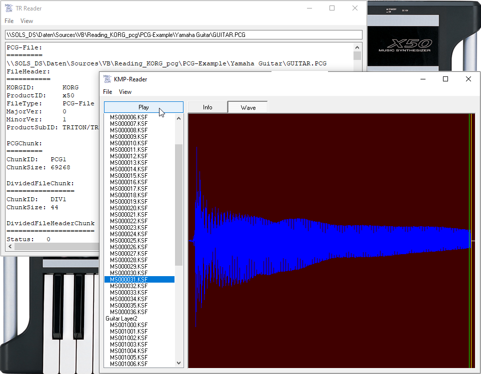

# Reading_KORG_pcg
## Reading the .pcg-fileformat for KORG synths in VB 

Reads files in .pcg-format; many Synths from KORGs e.g. the Triton line of 
synths can store and load these files, for sharing sound data between 
different synths like Triton, Triton LE, Karma, Triton Extreme, X50 etc. 
However some are not capable of loading samples, just sound settings, due 
to the lack of sample ram memory and sampling feature. 
.pcg-files can be found e.g. in the download-section of korgforums.com
 http://www.korgforums.com/downloads.htm

This VB-code i created in mid 2009 after i bought my very portable X50-Synth.
It is just a tiny sample project. Maybe it can not read every pcg-file, but 
it could serve as a starting point for your own implementations, or maybe 
just in case you want to see whats inside this or that pcg-file.

Click File->Open (e.g. "Yamaha Guitar\GUITAR.PCG") or maybe just drag'n'drop 
a pcg-file from windows explorer onto TR-Reader.
TR-Reader tries to read the file, please be patient for a second or two.
In the textbox it shows some informations about the read chunks.
Now click "View->Show Samples" and you can step through the samples (.KSF) in 
the Listbox on the left (if there are any). On the right click the button 
"Wave" in menu File click "Save All wav" (please be patient) now if you click 
the "Play"-button you can audition the samples (if there are any).
